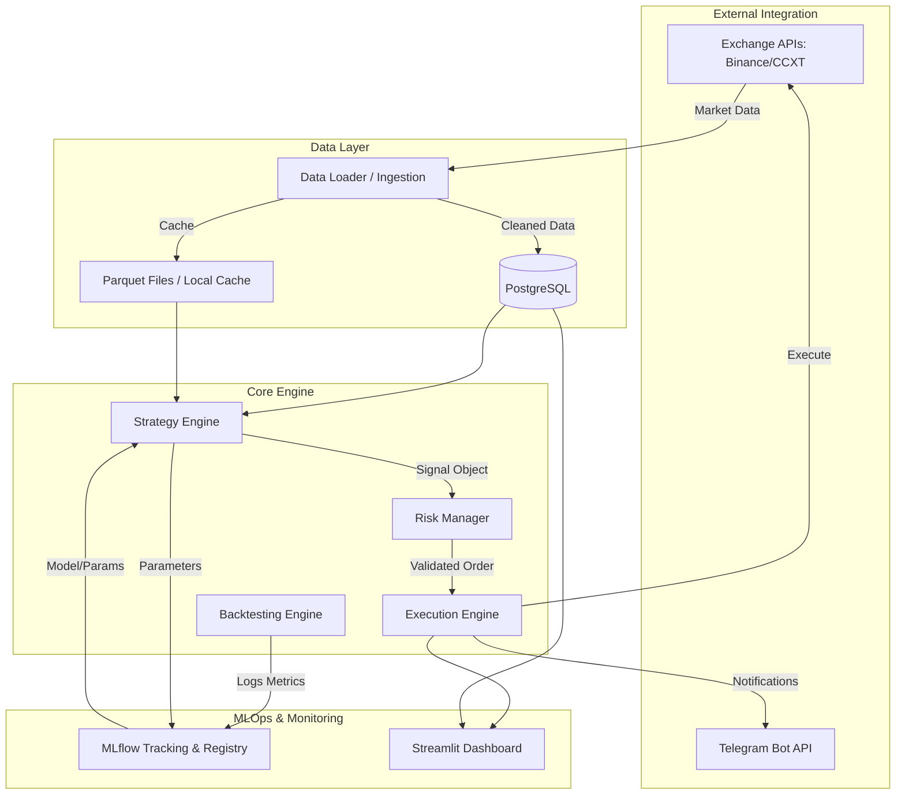

# 📉 Quantitative Trading System: System Architecture & Documentation

## 1. Executive Summary
This document outlines the end-to-end architecture and technical specifications for the Quantitative Trading System. The system is designed as a modular, high-performance algorithmic trading platform that supports multi-strategy execution, real-time risk management, automated backtesting, and MLOps integration via MLflow.

---

## 2. System Architecture

The system follows a modular micro-service-ready architecture. Each component is decoupled to allow for independent scaling and testing.

---

## 3. Component Deep Dive

### 3.1 Data Pipeline (`src/data_loader`)
*   **Historical Data**: Fetches OHLCV data from exchanges (via CCXT) for backtesting.
*   **Caching**: Stores data in `.parquet` format for high-speed local access.
*   **Real-time Feed**: (In Development) WebSocket integration for live price updates.

### 3.2 Strategy Framework (`src/strategies`)
*   **Base Strategy**: An abstract class defining the interface for all strategies.
*   **Signal Generation**: Process dataframes to produce `signal` columns (1: Long, -1: Short/Exit, 0: Neutral).
*   **Technical Analysis**: Leverages `pandas_ta` for robust indicator calculation (RSI, EMA, ATR, etc.).

### 3.3 Risk Management (`src/risk`)
*   **Position Sizing**: Calculates trade volume based on fixed % risk per trade and volatility (ATR).
*   **Safety Checks**:
    *   **Max Daily Loss**: Halts trading if a specific loss threshold is hit in 24h.
    *   **Max Drawdown**: Global "Kill Switch" if the portfolio drops below a certain % from its peak.
    *   **Stop Loss / Take Profit**: Dynamic calculation of exit points during entry.

### 3.4 Backtesting Engine (`src/backtesting`)
*   **Vectorized & Iterative Hybrid**: Uses vectorized calculation for speed where possible, but iterative loops for realistic risk management simulation.
*   **Metrics**: Calculates Sharpe Ratio, Sortino Ratio, Max Drawdown, Win Rate, and Profit Factor.
*   **MLflow Integration**: Automatically logs every backtest run's parameters and results.

### 3.5 MLOps Integration (`src/mlops` & MLflow)
*   **Tracking**: Logs strategy hyperparameters and performance metrics.
*   **Model Registry**: Stores the "Best" performing strategy configurations.
*   **Version Control**: Allows rolling back to previous strategy versions.

### 3.6 Execution Engine (`src/execution`)
*   **Order Management**: Interfaces with CCXT to place Market/Limit orders.
*   **Telegram Bot**: Sends real-time alerts for every trade execution, signal detection, and system status update.

### 3.7 Monitoring Dashboard (`src/dashboard`)
*   **Real-time PnL**: Visualizes current portfolio equity and open positions.
*   **Backtest Viewer**: Interactive charts for analyzing historical performance.

---

## 4. End-to-End Workflow

1.  **Research & Development**:
    *   Data is pulled via `DataLoader`.
    *   Strategies are developed in `notebooks/` and tested.
2.  **Backtesting & Optimization**:
    *   Run `scripts/run_backtest.py`.
    *   Results are pushed to **MLflow Server**.
    *   Select the best parameters from the MLflow UI.
3.  **Live Deployment**:
    *   The `ExecutionEngine` loads the production parameters from the **Model Registry**.
    *   Bot runs on a loop (every 1m, 15m, 1h, etc.).
4.  **Monitoring**:
    *   Traders monitor performance via the **Streamlit Dashboard** and **Telegram notifications**.

---

## 5. Technology Stack

| Category | Technology |
| :--- | :--- |
| **Language** | Python 3.9+ |
| **Data Processing** | Pandas, NumPy |
| **TA Library** | Pandas-TA |
| **Exchange API** | CCXT (Crypto Currency eXchange Trading) |
| **MLOps** | MLflow |
| **Database** | PostgreSQL |
| **Infrastructure** | Docker, Docker-Compose |
| **Dashboard** | Streamlit |
| **Communication** | Telegram Bot API |

---

## 6. Implementation Status & Roadmap

-   [x] Core Data Pipeline
-   [x] Base Strategy Framework
-   [x] Risk Management Module
-   [x] Backtesting Engine with Metrics
-   [x] Infrastructure (Postgres, MLflow)
-   [ ] Production Execution Engine (Live Trading)
-   [ ] Advanced Dashboard UI
-   [ ] Multi-Asset Portfolio Management

---

*Document Created: December 2025*
*Author: Antigravity AI*
